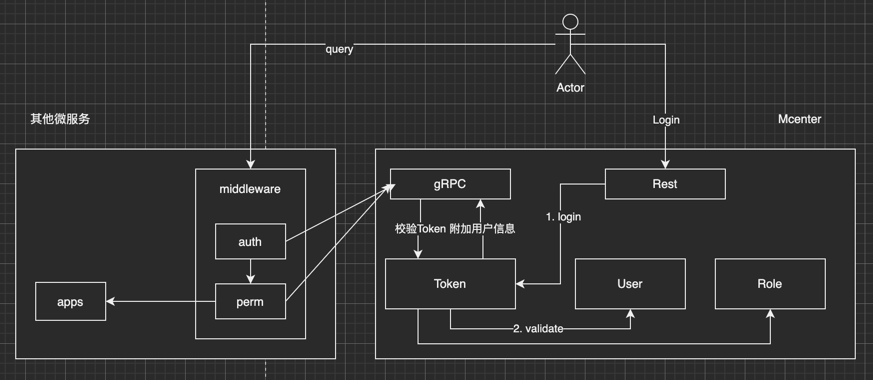
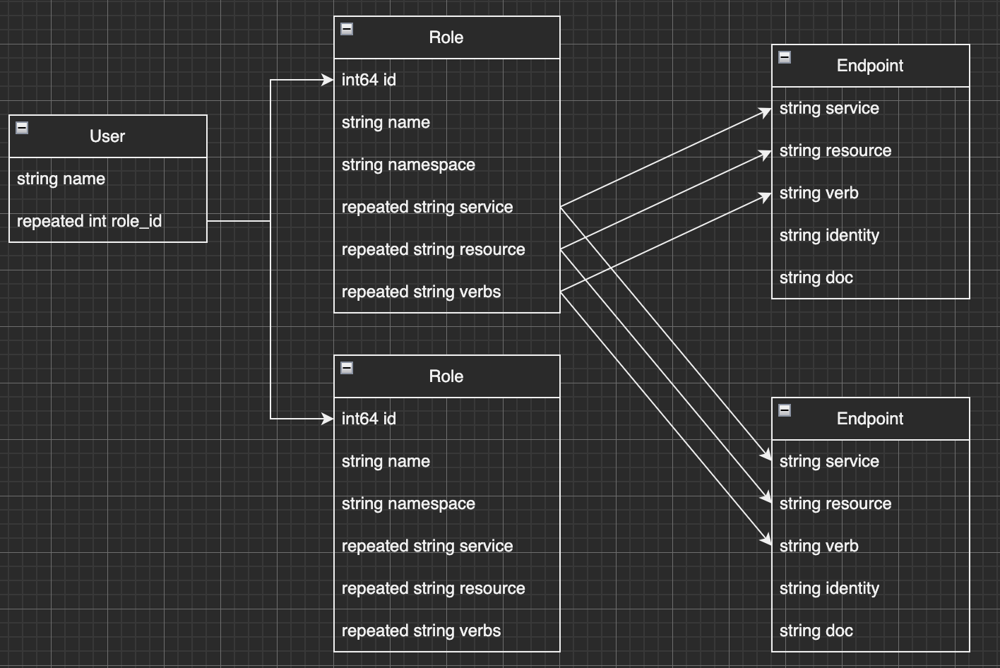

# mcenter
微服务认证中心


#### 服务能力
1. 基于标签机制的 RBAC 权限系统
2. 开箱即用的认证组件、权限组件，提供功能开关

##### 接入方式
> 导入endpoint 后，微服务每次启动都会将路由端点注册进 Mcenter
- `main.go`
```go
import (
    _ "github.com/qiaogy91/mcenter/provider/authentication" // 认证
    _ "github.com/qiaogy91/mcenter/provider/endpoint"       // 端点
    _ "github.com/qiaogy91/mcenter/provider/permission"     // 权限
)
```

- `api.go`
```go
package secret

func (h *Handler) Registry() {
    tag := []string{"凭证管理"}
    
    ws := gorestful.ModuleWebservice(h)
    ws.Route(ws.GET("/").To(h.Test).
        Doc("测试接口").
        Metadata(restfulspec.KeyOpenAPITags, tag).
        Metadata("auth", true).   // 为该路由打开认证开关
        Metadata("audit", true).  // 为该路由打开审计开关
        Metadata("perm", true).   // 为该路由打开权限校验开关
        Metadata("resource", secret.AppName).
        Metadata("action", "get").
        Metadata("doc", "测试接口"),
    )
}
```

#### 认证校验
##### 认证流程说明
<div style="text-align: center;">
    
</div>

1. 微服务接入 Mcenter，为路由打开 Auth、Perm 功能
2. 用户通过 Mcenter 进行Login，成功后返回 Token
3. 用户携带 Token 访问其他微服务（app01）
4. 微服务 app01 使用 Mcenter 提供的中间件，以 gRPC 方式去校验Token，通过后将用户角色权限信息附加到上下文 context 中
5. 微服务 app01 使用 Mcenter 提供的中间件，以 gRPC 方式去校验Route 权限，如果允许则放行，否则返回未授权

#### 权限校验
> 参考K8S RBAC 实现
##### 权限匹配说明
- Role 此处没有去关联 Endpoint 端点的ID
- 因为服务重启后，会删除掉旧端点、并重新注册新端点；此时Role 关联的ID 会丢失
- 因此，Mcenter 中使参考K8S 使用了标签匹配机制，不论服务的端点删除、创建多少次，只要标签不变，权限就不变
##### 数据结构设计
<div style="text-align: center;">
    
</div>

- K8S 参考角色定义如下：
```yaml
apiVersion: rbac.authorization.k8s.io/v1
kind: Role
metadata:
  namespace: default
  name: pod-reader
rules:
- apiGroups: [""] # "" 标明 core API 组
  resources: ["pods"]
  verbs: ["get", "watch", "list"]
```
- Mcenter 实现角色定义如下：
```sql
create table roles
(
    id          bigint auto_increment primary key,
    created_at  bigint   null,
    updated_at  bigint   null,
    name        longtext null,
    namespace   longtext null,
    service     longtext null,
    resource    longtext null,
    actions     longtext null,
    description longtext null
);
```

